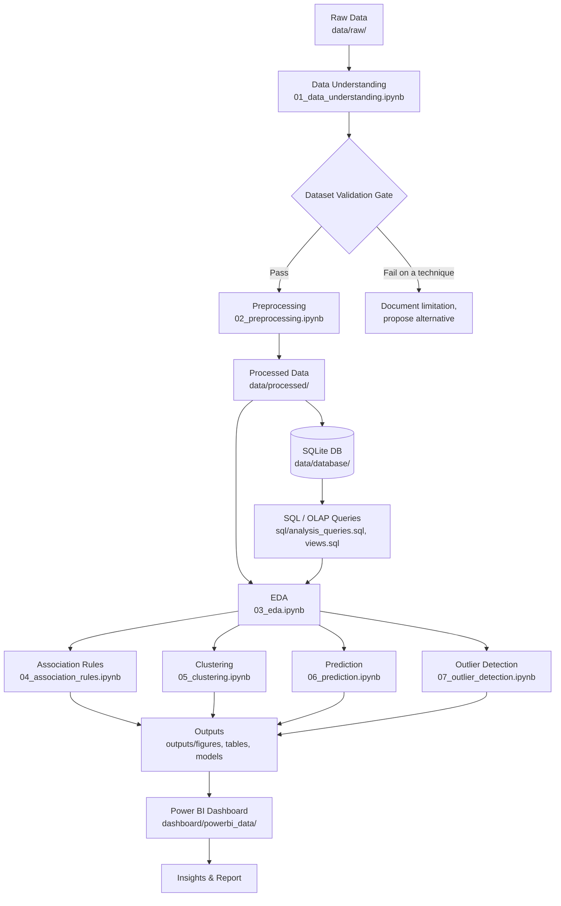

# Cyber Crime Analytics for National Security

An undergraduate **Data Analytics & Visualization / Data Mining** project analyzing
publicly available Indian cybercrime data across time, geography, and crime categories.

> **Status: Architecture phase.** No dataset has been supplied or analyzed yet.
> Nothing in this repository reflects real findings, real column names, or real
> results. See [`PROJECT_PLAN.md`](./PROJECT_PLAN.md) for the Dataset Validation
> Gate that must be completed before any analysis begins.

---

## 1. Project Objective

This project applies a complete data analytics and data mining lifecycle to
publicly available Indian cybercrime data in order to understand:

- How cybercrime has changed over time
- Which states/regions carry the highest cybercrime burden
- Which crime categories are increasing or decreasing
- Which states/regions have similar cybercrime profiles
- Whether meaningful relationships exist between crime categories
- Which observations behave unusually (anomalies)
- Whether future cybercrime levels can be reasonably estimated
- Whether states/regions can be grouped into meaningful, data-justified categories

The project is deliberately scoped as a **complete analytics pipeline**, not a
single dashboard or a single machine-learning model. Every technique used must
be justified by what the actual dataset supports — see Section 5.

---

## 2. Intended Analytics Pipeline

```
Data Collection
      │
      ▼
Data Understanding  ──────────►  Dataset Validation Gate
      │                                  │
      ▼                                  │ (must pass before
Data Preprocessing                       │  proceeding further)
      │                                  │
      ▼                                  │
SQL / OLAP Layer  ◄───────────────────────┘
      │
      ▼
Exploratory Data Analysis (EDA)
      │
      ├─────────────► Association Rule Mining (if transactional structure exists)
      ├─────────────► Classification / Regression (if a valid target exists)
      ├─────────────► Clustering (if meaningful numerical features exist)
      └─────────────► Outlier Detection (if sufficient data/features exist)
      │
      ▼
Visualization (Matplotlib / Seaborn)
      │
      ▼
Power BI Dashboard
      │
      ▼
Insights & Conclusions
```

### Data flow diagram (Mermaid)



---

## 3. Planned Technology Stack

| Layer | Tools |
|---|---|
| Language | Python |
| Data handling | Pandas, NumPy |
| Visualization | Matplotlib, Seaborn |
| Machine learning | Scikit-learn |
| Association rule mining | Mlxtend (if a defensible transactional structure exists) |
| Database | SQLite (SQL) |
| Dashboarding | Power BI |
| Inspection/validation | Excel (ad hoc only) |
| Experimentation | Jupyter Notebook |

No dependency is added until it is actually needed by a validated technique.

---

## 4. Repository Structure

```
cybercrime-analytics/
├── data/
│   ├── raw/            # Original, untouched source data (never modified)
│   ├── processed/       # Cleaned, analysis-ready data
│   └── database/        # SQLite database file(s)
├── notebooks/            # One notebook per pipeline stage
├── src/                  # Reusable Python modules backing the notebooks
├── sql/                  # Schema, analytical queries, views
├── outputs/
│   ├── figures/          # Saved charts
│   ├── models/           # Saved model artifacts
│   └── tables/           # Saved result tables (e.g., for Power BI)
├── dashboard/
│   └── powerbi_data/     # Final analysis-ready extracts for Power BI
├── requirements.txt
├── README.md
└── PROJECT_PLAN.md
```

---

## 5. Syllabus Mapping (summary)

A full mapping table is in [`PROJECT_PLAN.md`](./PROJECT_PLAN.md). In brief:

| Syllabus Unit | Where it appears |
|---|---|
| Introduction to Data Mining | Project framing, Stage 1 |
| Data Preprocessing | Stage 2 (`02_preprocessing.ipynb`, `src/preprocessing.py`) |
| Data Warehouse / OLAP | Stage 3 (`sql/`) |
| Frequent Pattern Mining (Apriori) | Stage 5 (`04_association_rules.ipynb`, `src/association_rules.py`) — only if justified |
| Classification & Prediction | Stage 7 (`06_prediction.ipynb`, `src/prediction.py`) — only if justified |
| Clustering & Outlier Detection | Stages 6 & 8 (`05_clustering.ipynb`, `07_outlier_detection.ipynb`) — only if justified |
| Visualization | Stage 4 and throughout (`src/eda.py`, `outputs/figures/`) |
| Interactive Dashboards | Stage 9 (`dashboard/`, Power BI — not yet built) |

---

## 6. Dataset Validation Gate

**No algorithm in this repository will be implemented against real data until
the dataset has been inspected and validated.** See the full gate criteria and
current status in [`PROJECT_PLAN.md`](./PROJECT_PLAN.md#dataset-validation-gate).

---

## 7. Expected Final Deliverables

1. Cleaned, analysis-ready dataset
2. Python notebooks documenting each pipeline stage
3. Reusable Python modules (`src/`)
4. SQL database/schema and analytical queries
5. Association-rule analysis (if supported by the data)
6. Clustering analysis (if supported by the data)
7. Predictive analysis (if supported by the data)
8. Outlier analysis (if supported by the data)
9. Power BI dashboard
10. Project report
11. Presentation
12. This documentation

---

## 8. Current Status

- [x] Repository architecture created
- [x] Real dataset supplied
- [x] Dataset Validation Gate completed
- [x] Preprocessing implemented
- [x] SQL schema & SQLite database populated with real structure and analytical views
- [x] EDA implemented
- [x] Association rule mining implemented (State-Level Syllabus Demonstration)
- [x] Clustering implemented (State-Level Profile Grouping)
- [ ] Prediction implemented (pending validation)
- [ ] Outlier detection implemented (pending validation)
- [ ] Power BI dashboard built
- [ ] Report and presentation finalized

## 9. Project Philosophy

Correct technique + correct data + correct interpretation. A small number of
strong, well-justified analyses is preferred over many weak ones forced in
merely to cover the syllabus.
