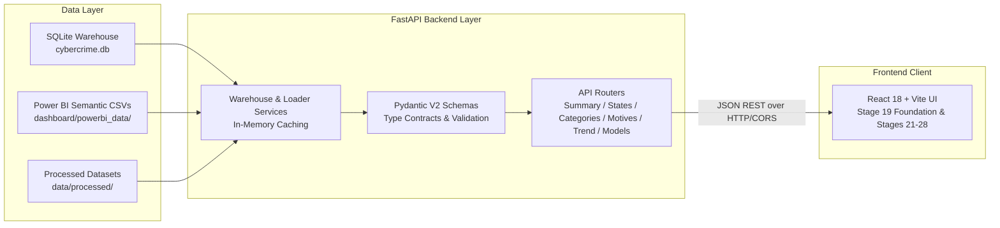

# Cyber Crime Analytics for National Security — Data Access API Specification

## 1. Architectural Overview & Design Philosophy

The Cyber Crime Analytics Backend is a **FastAPI-powered presentation and data access layer** built directly on top of the frozen, audited, and mathematically validated analytical artifacts produced across Stages 1–18 of the project.

> [!IMPORTANT]
> **Authoritative Pipeline Boundary**
> "The API exposes validated analytical outputs and does not perform model training or analytical recomputation."
>
> The backend strictly functions as a high-performance, read-only data access layer. It does NOT recalculate descriptive statistics, retrain machine learning models, rerun clustering or anomaly algorithms, or alter source records.



---

## 2. Server Configuration & Local Execution

### 2.1 Dependencies
Backend dependencies are specified in `backend/requirements.txt`:
- `fastapi>=0.115.0`
- `uvicorn[standard]>=0.30.0`
- `pydantic>=2.8.0`
- `pandas>=2.2.0`
- `numpy>=1.26.0`
- `httpx>=0.27.0`
- `pytest>=8.0.0`
- `pytest-asyncio>=0.23.0`

### 2.2 Local Execution
Start the backend server on port 8000:
```bash
# From repository root
uvicorn backend.app.main:app --reload --port 8000
```

Start the React frontend development server on port 5173:
```bash
cd frontend
npm run dev
```

### 2.3 Environment & CORS Settings
CORS is explicitly configured for local development and can be customized via environment variables:
- `CORS_ORIGINS`: Comma-separated list of allowed origins (Defaults: `http://localhost:5173,http://127.0.0.1:5173,http://localhost:3000,http://127.0.0.1:3000`).
- `DB_PATH`: Path to SQLite warehouse (Default: `data/database/cybercrime.db`).
- `DASHBOARD_DATA_DIR`: Path to Power BI semantic CSVs (Default: `dashboard/powerbi_data/`).
- `PROCESSED_DATA_DIR`: Path to processed master tables (Default: `data/processed/`).

---

## 3. Core National Reconciliation Baseline

Every endpoint adheres strictly to the audited national totals established in Stage 18:
1. **National Total 2023**: $86,420$ registered cybercrime cases.
2. **Statutory Act Groups**:
   - IT Act: $44,237$ cases ($51.19\%$)
   - IPC Sections: $41,849$ cases ($48.43\%$)
   - Special & Local Laws (SLL): $334$ cases ($0.39\%$)
   - Act Group Sum: $44,237 + 41,849 + 334 = 86,420$ ($100.00\%$).
3. **Motive Classification**:
   - Total Motive Cases: $86,420$ across $18$ specific motives.
   - Fraud Motive: $59,526$ cases ($68.88\%$).
4. **Geographic Scope**: $36$ jurisdictions ($28$ States, $8$ Union Territories).
5. **Top 5 State Volume Concentration**: $63,472$ cases ($73.45\%$).
6. **Top Leaf Category**: Sec. 66D Cheating by personation ($25,334$ cases, $29.31\%$).
7. **Second Leaf Category**: Sec. 420 IPC Cheating ($16,943$ cases, $19.61\%$).
8. **Combined Financial Fraud & Cheating**: $61,365$ cases ($71.01\%$).
9. **Cybercrimes Against Vulnerable Demographics**:
   - Women: $19,510$ cases ($22.58\%$)
   - Children: $1,902$ cases ($2.20\%$).
10. **Historical Longitudinal Series (2018–2022)**:
    - National volume expanded from $27,248$ (2018) to $65,893$ (2022) ($+141.83\%$).
    - Ladakh 2018 & 2019 missingness preserved as JSON `null` (zero interpolation or fabrication).

---

## 4. API Endpoints Reference

### 4.1 System Health
- **Endpoint**: `GET /api/health`
- **Authoritative Provenance**: App Configuration & Stage 1–18 Freeze Manifest
- **Response**:
```json
{
  "status": "ok",
  "project": "Cyber Crime Analytics for National Security",
  "data_status": "validated",
  "analytical_stages": "Stages 1–18 Audited & Frozen",
  "ui_stage": 20
}
```

---

### 4.2 Executive Summary
- **Endpoint**: `GET /api/summary`
- **Authoritative Provenance**: `dashboard/powerbi_data/kpi_executive_summary.csv` & SQLite `vw_state_cybercrime_summary`
- **Response Model**: `ExecutiveSummaryResponse`
- **Key Fields**:
  - `total_cases`: $86,420$
  - `state_count`: $36$
  - `leaf_category_count`: $40$
  - `it_act_cases`: $44,237$
  - `ipc_cases`: $41,849$
  - `sll_cases`: $334$
  - `fraud_motive_cases`: $59,526$
  - `financial_fraud_cases`: $61,365$
  - `top_state`: `"Karnataka"` ($21,889$ cases, $25.33\%$)
  - `top5_cases`: $63,472$ ($73.45\%$)
  - `historical_growth_pct`: $141.83\%$

---

### 4.3 State & UT Dimensional Explorer
- **Endpoint**: `GET /api/states`
- **Query Parameters**:
  - `state` *(string, optional)*: Substring filter on state name.
  - `admin_type` *(string, optional)*: Filter by `"State"` or `"Union Territory"` (or `"ut"`).
  - `sort_by` *(string, default: `"total_cases"`)*: Field to sort on.
  - `order` *(string, default: `"desc"`)*: `"asc"` or `"desc"`.
  - `limit` *(integer, optional)*: Maximum records to return.
- **Authoritative Provenance**: `dashboard/powerbi_data/state_summary_2023.csv` & `cybercrime.db` (`dim_state`, `v_state_summary_2023`)
- **Response Model**: `StatesListResponse`

---

### 4.4 Statutory Crime Category Explorer
- **Endpoint**: `GET /api/categories`
- **Query Parameters**:
  - `act_group` *(string, optional)*: Filter by `"IT Act"`, `"IPC"`, or `"SLL"`.
  - `leaf_only` *(boolean, default: `false`)*: When `true`, filters out parent roll-up subtotals and returns exactly the 40 independent leaf categories.
  - `sort_by` *(string, default: `"national_cases"`)*: Field to sort on.
  - `order` *(string, default: `"desc"`)*: `"asc"` or `"desc"`.
  - `limit` *(integer, optional)*: Limit number of records.
- **Authoritative Provenance**: `cybercrime.db` (`vw_category_cybercrime_summary`) & `dashboard/powerbi_data/category_summary_2023.csv`
- **Response Model**: `CategoriesListResponse`
- **Preservation Note**: Preserves exact analytical distinction between 40 independent leaf categories (summing to $86,420$) and 9 parent roll-up subtotals without double-counting.

---

### 4.5 Stated Motive Dimension
- **Endpoint**: `GET /api/motives`
- **Query Parameters**:
  - `exclude_total` *(boolean, default: `true`)*: Excludes the redundant grand total row ($86,420$) and returns the 18 specific motives.
  - `sort_by` *(string, default: `"national_cases"`)*: Sort column.
  - `order` *(string, default: `"desc"`)*: Sort order.
  - `limit` *(integer, optional)*: Limit records.
- **Authoritative Provenance**: `dashboard/powerbi_data/motive_summary_2023.csv` & SQLite `vw_motive_summary`
- **Response Model**: `MotivesListResponse`

---

### 4.6 Historical Longitudinal Trends (2018–2022)
- **Endpoint**: `GET /api/trend`
- **Query Parameters**:
  - `state` *(string, optional)*: Filter specific state trajectory.
  - `admin_type` *(string, optional)*: Filter States vs Union Territories.
- **Authoritative Provenance**: `data/processed/trend_2018_2022.csv` & `dashboard/powerbi_data/trend_summary_2018_2022.csv`
- **Response Model**: `TrendResponse`
- **Isolation Note**: Strictly separate from the 2023 single-year detailed cross-tabulation. Preserves Ladakh 2018/2019 pre-bifurcation missingness as JSON `null`.

---

### 4.7 Validated Machine Learning Models

#### 4.7.1 Classification Benchmark (Stage 13)
- **Endpoint**: `GET /api/models/classification`
- **Authoritative Provenance**: `dashboard/powerbi_data/model_classification_comparison.csv`, `model_classification_confusion_matrices.csv`, and `outputs/tables/stage13_feature_importance.csv`
- **Methodological Context**: Evaluates binary high-volume regime classification ($\text{HIGH\_NEXT\_YEAR} = 1$ if $y_t \ge 367.0$ cases, else $0$) based on 6 historical lag features (`lag_1`, `lag_2`, `lag_diff`, `lag_growth_rate`, `log_lag_1`, `log_lag_2`) with zero contemporaneous leakage. Threshold ($367.0$) is derived strictly from the training partition median ($N_{\text{train}}=70$, target years 2020–2021). Evaluated on the 2022 held-out test partition ($N_{\text{test}}=36$).
- **Evaluated Models**: Baseline Most Frequent ($44.44\%$), Decision Tree depth=3 ($97.22\%$, $\text{Balanced Acc}=97.50\%$, $\text{Precision}=100.0\%$, $\text{Recall}=95.00\%$, $\text{F1}=0.9744$, $\text{ROC-AUC}=0.9750$), Gaussian Naive Bayes ($100.0\%$), Linear SVM ($100.0\%$), RBF SVM ($100.0\%$), Random Forest ($100.0\%$).
- **Feature Importance**: Decision Tree concentrates $94.44\%$ Gini importance on $\log(1+\text{lag}_1)$; Random Forest balances across $\log(1+\text{lag}_1)$ ($27.14\%$), $\log(1+\text{lag}_2)$ ($25.42\%$), $\text{lag}_2$ ($23.72\%$), $\text{lag}_1$ ($21.26\%$).
- **Non-Causal Disclaimer**: High classification accuracy reflects strong temporal volume persistence across jurisdictions rather than commercial deployment readiness or causal determinants.
- **Response Model**: `ClassificationResponse`

#### 4.7.2 Predictive Regression Benchmark (Stages 7 & 14)
- **Endpoint**: `GET /api/models/regression`
- **Authoritative Provenance**: `dashboard/powerbi_data/model_regression_leaderboard.csv` & `model_prediction_actual_vs_predicted.csv`
- **Selected Top Predictor**: **Log-Linear OLS** (MAE: $479.37$, RMSE: $1,143.46$, $R^2$: $0.9000$, Median AE: $69.85$).
- **Response Model**: `RegressionResponse`

#### 4.7.3 Association Rule Mining (Stages 5 & 12)
- **Endpoint**: `GET /api/models/association`
- **Authoritative Provenance**: `dashboard/powerbi_data/model_association_rules_key.csv` & `outputs/tables/association_rules_all.csv`
- **Methodological Context**: Syllabus demonstration of Apriori & FP-Growth mining on $N=36$ binarized state profiles. Mined $129$ frequent itemsets and $1,924$ filtered rules.
- **Response Model**: `AssociationResponse`

#### 4.7.4 Unsupervised Compositional Clustering (Stages 6 & 15)
- **Endpoint**: `GET /api/models/clustering`
- **Authoritative Provenance**: `dashboard/powerbi_data/model_cluster_profiles.csv`, `model_cluster_assignments.csv`, `outputs/tables/clustering_evaluation.csv`, and `outputs/tables/stage15_algorithm_comparison.csv`
- **Baseline Solution**: Primary Stage 6 / Stage 15 $K=4$ K-Means clustering ($K=4$, $\text{Silhouette}=0.3497$, $\text{Calinski-Harabasz}=20.25$, $\text{Davies-Bouldin}=0.8849$, $\text{Inertia}=49.6849$, `StandardScaler`, `random_state=42`) using 4 standardized composition share features (`it_act_share`, `fraud_motive_share`, `extortion_motive_share`, `sexual_exploitation_motive_share`).
- **Response Model**: `ClusteringResponse`

#### 4.7.5 Multivariate Outlier & Anomaly Detection (Stages 8 & 16)
- **Endpoint**: `GET /api/models/outliers`
- **Authoritative Provenance**: `dashboard/powerbi_data/model_outlier_consensus.csv` & `model_outlier_volume_vs_composition.csv`
- **Methodological Framing**: Evaluates statistical extremity across 4 complementary anomaly methods (IQR, Robust Z-score, Mahalanobis Distance, Local Outlier Factor). Consensus identifies 3 unanimous departures: Karnataka, Dadra & Nagar Haveli and Daman & Diu, and Lakshadweep.
- **Response Model**: `OutliersResponse`

---

## 5. Error Handling Standards

All backend endpoints provide predictable JSON error responses adhering to RFC 7807 principles:
- **400 Bad Request**: Invalid query parameters or contradictory filters.
- **404 Not Found**: Resource or entity not present in the dimensional tables.
- **500 Internal Server Error**: Sanitized operational errors preventing internal stack trace disclosure.

Interactive OpenAPI 3.1 documentation is available at `http://localhost:8000/docs`.
