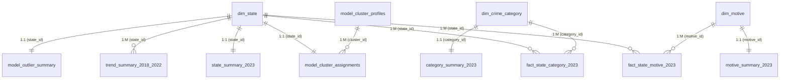

# Power BI Dashboard Specification & Architecture Guide
**Project**: Cyber Crime Analytics for National Security  
**Data Sources**: NCRB 2023 Detailed Cybercrime Dataset & Rajya Sabha / NCRB Historical Series (2018–2022)  
**Deliverable Type**: Power BI Semantic Data Package, Star/Snowflake Data Model & 6-Page Visual Specification  
**Status**: Data Package Fully Prepared & Validated under `dashboard/powerbi_data/`

---

## 1. Executive Summary & Purpose

The purpose of this Power BI Dashboard integration is to provide an interactive, defensible, and academically rigorous visualization layer for the entire analytics pipeline (Stages 1 through 8).

### Critical Data Architecture Principles:
1. **Repository as Single Source of Truth**: All metrics, classifications, cluster profiles, and prediction scores are extracted directly from the verified database views (`sql/views.sql`) and validated Stage 3–8 analytical output tables. No unverified calculations are performed in Power BI.
2. **Strict Historical Data Separation**: The historical 2018–2022 series and the 2023 detailed NCRB dataset are maintained as separate tables. They are **never** concatenated into a continuous 2018–2023 line due to known source table discrepancies.
3. **Small-Denominator Caution**: Union Territories with tiny sample sizes ($N \le 10$) are accompanied by explicit visual tooltips and disclaimers explaining that extreme percentage shares (e.g., $100\%$ sexual exploitation in Lakshadweep on $N=1$) are small-denominator mathematical artifacts rather than high crime volume.
4. **Descriptive, Non-Causal Language**: Prohibits alarmist or criminalizing terminology (e.g., "high-risk state", "crime hotspot", "dangerous jurisdiction"). Uses objective statistical descriptions (e.g., "highest reported case volume", "statistical outlier observation").

---

## 2. Semantic Data Model & Relationships

The Power BI data model follows a **Star / Snowflake Schema** centered around primary 2023 fact tables, separated historical trends, and analytical model output tables.

### Table Catalog (`dashboard/powerbi_data/`)

| Table Name | Type | Rows | Primary / Foreign Keys | Description |
|---|---|---|---|---|
| `dim_state` | Dimension | 36 | `state_id` (PK) | 36 Indian States and Union Territories with `is_ut` flag |
| `dim_crime_category` | Dimension | 49 | `category_id` (PK) | 40 leaf categories + 9 parent groups with legal classifications |
| `dim_motive` | Dimension | 19 | `motive_id` (PK) | 18 independent motives + 1 grand total motive flag |
| `dim_act_group` | Dimension / Rollup | 3 | `act_group` (PK) | High-level legal acts: IT Act, IPC crimes r/w IT Act, SLL crimes |
| `fact_state_category_2023` | Fact | 1,764 | `(state_id, category_id)` | Granular case counts across 36 states and 49 categories (2023) |
| `fact_state_motive_2023` | Fact | 684 | `(state_id, motive_id)` | Granular motive counts across 36 states and 19 motives (2023) |
| `state_summary_2023` | Summary Fact | 36 | `state_id` (PK) | Pre-aggregated state totals, act shares, fraud, women, child counts |
| `category_summary_2023` | Summary Dimension | 40 | `category_id` (PK) | National leaf category totals, shares, and Pareto cumulative % |
| `motive_summary_2023` | Summary Dimension | 19 | `motive_id` (PK) | National motive case counts and % shares |
| `trend_summary_2018_2022` | Historical Fact | 180 | `(state_id, year)` | State-level annual counts (2018–2022) with YoY change and % growth |
| `trend_national_2018_2022` | Historical Fact | 5 | `year` (PK) | National total annual cases (2018–2022) with historical note |
| `model_association_rules_key` | Analytical Model | 42 | `rule_id` (PK) | Curated 1-to-1 interpretable rules with support, confidence, lift |
| `model_cluster_profiles` | Analytical Model | 4 | `cluster_id` (PK) | 4 K-Means cluster composition profiles and descriptive labels |
| `model_cluster_assignments` | Analytical Model | 36 | `state_id` (PK) | State cluster assignments, cluster labels, and feature values |
| `model_prediction_metrics` | Analytical Model | 7 | `model_name` (PK) | 7 predictive models evaluated on 2022 test set (MAE, RMSE, R²) |
| `model_prediction_actual_vs_predicted` | Analytical Model | 36 | `state_name` (PK) | 2022 actual vs predicted state volume with residual errors |
| `model_outlier_summary` | Analytical Model | 36 | `state_id` (PK) | State outlier classification synthesis (None, Univariate, Both, Multi) |
| `model_outlier_univariate` | Analytical Model | 52 | `(state_name, feature)` | Flagged Tukey fence violations with small-denominator caution tags |
| `kpi_executive_summary` | Executive Dimension | 15 | `kpi_name` (PK) | Formatted key performance indicator summary |
| `metadata_project_limitations` | Metadata Dimension | 6 | `limitation_id` (PK) | 6 core academic limitations and methodological scope notes |

---

### Entity-Relationship Diagram (ERD)



---

## 3. Standardized DAX Measure Library

Create the following measures in a dedicated `_Measures` table in Power BI:

### Core Volume Measures
```dax
// 1. Total 2023 Cybercrime Cases (Reconciles to 86,420)
Total Cases 2023 = 
CALCULATE(
    SUM(fact_state_category_2023[cases]),
    dim_crime_category[is_leaf] = 1
)

// 2. IT Act Cases (Reconciles to 44,237)
IT Act Cases = 
CALCULATE(
    SUM(fact_state_category_2023[cases]),
    dim_crime_category[is_leaf] = 1,
    dim_crime_category[act_group] = "IT Act"
)

// 3. IPC Crimes r/w IT Act Cases (Reconciles to 41,849)
IPC Cases = 
CALCULATE(
    SUM(fact_state_category_2023[cases]),
    dim_crime_category[is_leaf] = 1,
    dim_crime_category[act_group] = "IPC"
)

// 4. SLL Crimes Cases (Reconciles to 334)
SLL Cases = 
CALCULATE(
    SUM(fact_state_category_2023[cases]),
    dim_crime_category[is_leaf] = 1,
    dim_crime_category[act_group] = "SLL"
)

// 5. Total States Evaluated (Reconciles to 36)
State Count = DISTINCTCOUNT(dim_state[state_id])
```

### Share & Ratio Measures
```dax
// 6. IT Act Share % (Reconciles to 51.19%)
IT Act Share % = 
DIVIDE([IT Act Cases], [Total Cases 2023], 0)

// 7. IPC Share % (Reconciles to 48.79%)
IPC Share % = 
DIVIDE([IPC Cases], [Total Cases 2023], 0)

// 8. Fraud Motive Cases (Reconciles to 59,526)
Fraud Motive Cases = 
CALCULATE(
    SUM(fact_state_motive_2023[motive_count]),
    dim_motive[motive_display_name] = "Fraud"
)

// 9. Fraud Motive Share % (Reconciles to 68.88%)
Fraud Motive Share % = 
DIVIDE([Fraud Motive Cases], [Total Cases 2023], 0)

// 10. Women Cybercrime Cases (Reconciles to 19,510)
Women Cybercrime Cases = 
SUM(state_summary_2023[women_cases_total])

// 11. Children Cybercrime Cases (Reconciles to 1,902)
Children Cybercrime Cases = 
SUM(state_summary_2023[child_cases_total])
```

---

## 4. 6-Page Visual & Layout Architecture

---

### Page 1 — Executive Overview
* **Purpose**: High-level national briefing presenting key scale indicators, legal act decomposition, and top reported offense categories.

#### Layout Wireframe:
```text
+----------------------------------------------------------------------------------------------------+
| [TITLE BANNER] Cyber Crime Analytics for National Security — Executive Overview (2023 NCRB)       |
+----------------------------------------------------------------------------------------------------+
| [CARD 1] Total Cases  | [CARD 2] Fraud Motive | [CARD 3] IT Act Share | [CARD 4] Women Cases       |
| 86,420 Cases          | 59,526 (68.88%)       | 44,237 (51.19%)       | 19,510 Cases               |
+----------------------------------------------------------------------------------------------------+
| Visual 1: State Case Volume Ranking (Top 10)  | Visual 2: Legal Act Framework Composition          |
| (Horizontal Bar Chart)                        | (Donut Chart / Clustered Bar)                      |
| - Karnataka: 21,889                           | - IT Act: 44,237 (51.19%)                          |
| - Telangana: 18,236                           | - IPC r/w IT Act: 41,849 (48.43%)                  |
| - Uttar Pradesh: 10,794                       | - SLL: 334 (0.39%)                                  |
| - Maharashtra: 8,103                          |                                                    |
+----------------------------------------------------------------------------------------------------+
| Visual 3: Top Leaf Crime Categories (Cases & National Share %)                                     |
| (Table / Horizontal Bar Chart with Pareto Cumulative Line)                                         |
| - Sec. 66D Cheating by Personation: 25,334 (29.31%)                                                |
| - Sec. 420 IPC Cheating (Fraud): 16,943 (19.61%)                                                   |
| - Sec. 420 r/w 465, 468-471 IPC (E-Commerce): 6,034 (6.98%)                                         |
| - Sec. 420 r/w 465, 468-471 IPC (Banking): 5,116 (5.92%)                                            |
| - Sec. 66C Identity Theft: 4,978 (5.76%)                                                           |
+----------------------------------------------------------------------------------------------------+
```

---

### Page 2 — Geographic / State Analysis
* **Purpose**: Interactive jurisdictional exploration across all 36 Indian States and Union Territories.

#### Key Visuals:
1. **Slicer**: `dim_state[state_name]` and `dim_state[is_ut]` (State vs UT toggle).
2. **Visual 1 (Horizontal Bar Chart)**: Total Cases by State/UT (Sorted descending, all 36 jurisdictions).
3. **Visual 2 (State Multi-Metric Card / Gauge)**: Dynamic KPI summary responding to state selection:
   - State Name & National Rank
   - Total Leaf Cases
   - IT Act Cases & Share %
   - IPC Cases & Share %
   - Fraud Motive Cases & Share %
   - Cybercrimes Against Women
   - Cybercrimes Against Children
4. **Visual 3 (Stacked Bar Chart)**: Case Volume by Legal Act Group across States (`IT Act` vs `IPC`).
5. **Academic Guardrail Note**: "Raw case counts represent registered police cases; variations reflect reporting practices and population scales, not crime rates per capita."

---

### Page 3 — Crime Categories & Motives
* **Purpose**: In-depth taxonomy analysis separating independent offenses from underlying motives.

#### Key Visuals:
1. **Visual 1 (Pareto Chart / Table)**: 40 Independent Leaf Categories sorted by volume:
   - Bar: National Cases
   - Line: Cumulative Share % (Demonstrates that top 2 categories account for $75.14\%$ of national volume).
2. **Visual 2 (Horizontal Bar Chart)**: Distribution of Reported Cybercrime Motives (18 motives):
   - **Fraud**: $59,526$ ($68.88\%$)
   - **Extortion**: $4,990$ ($5.77\%$)
   - **Sexual Exploitation**: $4,749$ ($5.50\%$)
   - **Personal Revenge**: $1,574$ ($1.82\%$)
   - **Anger**: $1,281$ ($1.48\%$)
3. **Visual 3 (Matrix Grid)**: State $\times$ Major Motive Cross-Tabulation (Fraud, Extortion, Sexual Exploitation, Other).
4. **Key Callout**: "Financial fraud represents more than two-thirds ($68.88\%$) of all recorded cybercrime motives nationwide."

---

### Page 4 — Analytical Models (Stages 5, 6, & 8)
* **Purpose**: Clear, modular presentation of unsupervised clustering, association rules, and outlier detection.

#### Visual Sections:
1. **Section A — State-Level Association Rules (Stage 5)**:
   - Table of Curated Key Rules (`model_association_rules_key.csv`):
     - Antecedent $\rightarrow$ Consequent
     - Support, Confidence, Lift
     - Highlight: `HIGH_FRAUD_MOTIVE -> HIGH_SEC66D_CHEATING` (Conf: 94.4%, Lift: 1.51)
     - Highlight: `HIGH_WOMEN_CYBERCRIME -> HIGH_SEXUAL_EXPLOITATION_MOTIVE` (Conf: 83.3%, Lift: 1.88)
   - Methodology Note: "Syllabus demonstration using 36 aggregate state transactions; measures statistical co-occurrence, not causation."
2. **Section B — Cybercrime Composition Profiles (Stage 6 Clustering)**:
   - Matrix / Card View of 4 K-Means Cluster Profiles:
     - **Cluster 0 (Lower IT Act Share / Moderate Fraud Share)**: 15 States/UTs (41.67%)
     - **Cluster 1 (Higher IT Act Share / Higher Fraud Share)**: 12 States/UTs (33.33%)
     - **Cluster 2 (High Sexual-Exploitation Share / Small-Denominator)**: 2 UTs (5.56%, Dadra & Nagar Haveli, Lakshadweep)
     - **Cluster 3 (Higher Extortion Motive Share)**: 7 States/UTs (19.44%, Assam, Kerala, Uttarakhand, Chandigarh, etc.)
3. **Section C — Descriptive Outlier Detection (Stage 8)**:
   - Classification Summary Donut: 18 No Outliers ($50\%$), 12 Univariate Only ($33.3\%$), 5 Both ($13.9\%$), 1 Multivariate Only ($2.8\%$).
   - Table of Flagged Observations with Small-Denominator Warning Tag.

---

### Page 5 — Historical Trend & Predictive Analysis (Stages 3 & 7)
* **Purpose**: Clear separation between the historical 2018–2022 panel and the held-out 2022 predictive modeling.

#### Key Visuals:
1. **Visual 1 (Line Chart - Historical Series)**: National Cybercrime Trajectory (2018–2022):
   - 2018: 27,248 $\rightarrow$ 2019: 44,735 $\rightarrow$ 2020: 50,035 $\rightarrow$ 2021: 52,974 $\rightarrow$ 2022: 65,893.
   - **Prominent Banner**: "Historical NCRB/Rajya Sabha Series (2018–2022) — Maintained separately from 2023 dataset due to structural table differences."
2. **Visual 2 (Model Evaluation Leaderboard)**: Comparison of 7 evaluated models on held-out 2022 test set:
   - **Log-Linear Regression (Log OLS - Best)**: $\text{MAE} = 479.37$, $\text{RMSE} = 1,143.46$, $R^2 = 0.9000$.
   - **Naive Persistent Baseline ($y_{t-1}$)**: $\text{MAE} = 564.75$, $\text{RMSE} = 1,340.75$, $R^2 = 0.8625$.
   - **Random Forest (depth=3)**: $\text{MAE} = 582.24$, $\text{RMSE} = 1,559.55$, $R^2 = 0.8139$.
   - **Linear Regression (Raw OLS)**: $\text{MAE} = 776.08$, $\text{RMSE} = 1,680.13$, $R^2 = 0.7840$.
3. **Visual 3 (Scatter Plot / Clustered Bar)**: 2022 Actual vs. Predicted Cases by State/UT for Log-Linear model.

---

### Page 6 — Data Sources & Methodological Limitations
* **Purpose**: Academic defensibility page detailing foundational assumptions, sources, and analytical guardrails.

#### Key Components:
1. **Data Provenance Table**:
   - Table 9A.1 (2023 NCRB Detailed State-Category Cross-Section)
   - Table 9A.2 (2023 NCRB Detailed State-Motive Cross-Section)
   - Rajya Sabha Unstarred Question No. 223 / NCRB Archival Tables (2018–2022 Historical Series)
2. **Analytical Methods Applied**: SQL/OLAP, Exploratory Data Analysis, Apriori Association Rules, K-Means Clustering, Lagged Panel Regression, Tukey IQR & Isolation Forest Outlier Detection.
3. **Structured Limitations Grid (6 Core Principles)**:
   - `LIM-01`: No population normalization (Raw police counts $\neq$ per-capita incidence rates).
   - `LIM-02`: Temporal discontinuity (2018–2022 and 2023 datasets are separate series).
   - `LIM-03`: Short historical window (5 years; ARIMA/deep time-series invalid).
   - `LIM-04`: Small cross-sectional sample ($N=36$; strict degrees-of-freedom care).
   - `LIM-05`: Macro-aggregate transaction representation (Proxy for syllabus demonstration).
   - `LIM-06`: Small-denominator distortion (Percentages in UTs driven by small denominators).

---

## 5. Step-by-Step Power BI Desktop Assembly Guide

To load and assemble the `.pbix` dashboard in Power BI Desktop:

1. **Launch Power BI Desktop**.
2. **Get Data $\rightarrow$ Folder** or **Text/CSV**:
   - Select the directory `dashboard/powerbi_data/`.
   - Load all 18 CSV files.
3. **Verify Data Types**:
   - `state_id`, `category_id`, `motive_id`, `year`, `year_id`: Whole Number.
   - `cases`, `motive_count`, `total_leaf_cases`, `reported_grand_total`: Whole Number.
   - `share_pct`, `support`, `confidence`, `lift`, `MAE`, `RMSE`, `R2`: Decimal Number.
   - `is_ut`, `is_leaf`, `is_total`: True/False (or 0/1 Whole Number).
4. **Configure Relationships**:
   - In Model View, connect `dim_state[state_id]` $\rightarrow$ `fact_state_category_2023[state_id]` (1:M, Single).
   - Connect `dim_crime_category[category_id]` $\rightarrow$ `fact_state_category_2023[category_id]` (1:M, Single).
   - Connect `dim_motive[motive_id]` $\rightarrow$ `fact_state_motive_2023[motive_id]` (1:M, Single).
   - Connect `dim_state[state_id]` $\rightarrow$ `state_summary_2023[state_id]` (1:1, Both).
   - Connect `dim_state[state_id]` $\rightarrow$ `trend_summary_2018_2022[state_id]` (1:M, Single).
   - Connect `dim_state[state_id]` $\rightarrow$ `model_cluster_assignments[state_id]` (1:1, Both).
   - Connect `dim_state[state_id]` $\rightarrow$ `model_outlier_summary[state_id]` (1:1, Both).
5. **Create DAX Measures**:
   - Create a new table named `_Measures`.
   - Add the 11 DAX formulas specified in Section 3.
6. **Build Pages 1 through 6**:
   - Create 6 separate report tabs following the layouts and field bindings in Section 4.
   - Apply clean color theme: Slate / Navy `#1E293B`, Deep Blue `#2563EB`, Accent Cyan `#06B6D4`, Neutral Light `#F8FAFC`.
7. **Run QA Reconciliation**:
   - Verify all KPIs match Section 6 reconciliation values exactly.

---

## 6. QA Reconciliation Matrix

All numbers displayed in Power BI must match these authoritative values:

| Metric | Target Value | Source Table / Verification | Status |
|---|---|---|---|
| 2023 National Total Cases | **86,420** | `state_summary_2023.csv` (`total_cases` sum) | Verified |
| 2023 IT Act Total Cases | **44,237** | `dim_act_group.csv` (`total_cases`) | Verified |
| 2023 IT Act Share % | **51.19%** | `dim_act_group.csv` (`share_pct`) | Verified |
| 2023 IPC r/w IT Act Total Cases | **41,849** | `dim_act_group.csv` (`total_cases`) | Verified |
| 2023 IPC Share % | **48.43%** | `dim_act_group.csv` (`share_pct`) | Verified |
| 2023 SLL Crimes Total Cases | **334** | `dim_act_group.csv` (`total_cases`) | Verified |
| 2023 SLL Share % | **0.39%** | `dim_act_group.csv` (`share_pct`) | Verified |
| 2023 Fraud Motive Total Cases | **59,526** | `motive_summary_2023.csv` (`Fraud` row) | Verified |
| 2023 Fraud Motive Share % | **68.88%** | `motive_summary_2023.csv` (`Fraud` row) | Verified |
| 2023 Cybercrimes Against Women | **19,510** | `state_summary_2023.csv` (`women_cases_total` sum) | Verified |
| 2023 Cybercrimes Against Children | **1,902** | `state_summary_2023.csv` (`child_cases_total` sum) | Verified |
| Top State Case Volume (Karnataka) | **21,889** | `state_summary_2023.csv` (Rank 1) | Verified |
| Second State Case Volume (Telangana) | **18,236** | `state_summary_2023.csv` (Rank 2) | Verified |
| 2018 Historical National Total | **27,248** | `trend_national_2018_2022.csv` | Verified |
| 2022 Historical National Total | **65,893** | `trend_national_2018_2022.csv` | Verified |
| Log-Linear Model MAE (2022 Test) | **479.37** | `model_prediction_metrics.csv` | Verified |
| Log-Linear Model R² (2022 Test) | **0.9000** | `model_prediction_metrics.csv` | Verified |
| Number of Clustering Profiles | **4** | `model_cluster_profiles.csv` | Verified |
| Multivariate Outliers Flagged | **6** | `model_outlier_summary.csv` (`is_multivariate_outlier` sum) | Verified |

---
